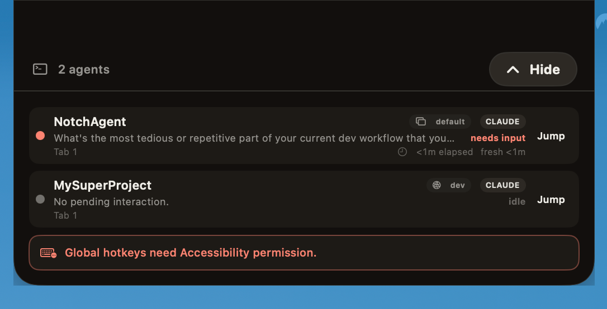
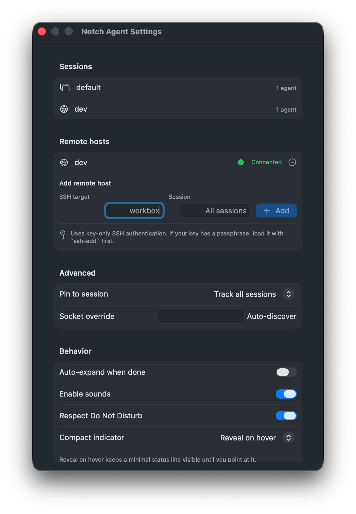
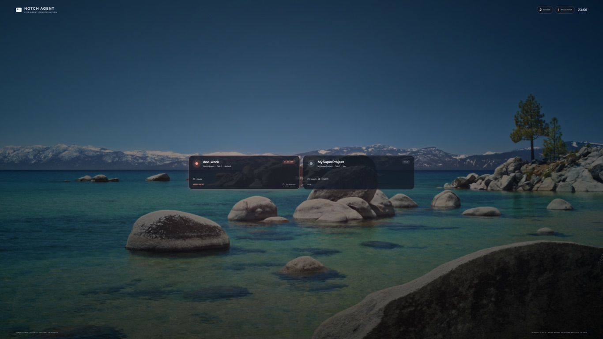

# NotchAgent

A native macOS notch control surface for AI coding agents running under
[herdr](https://herdr.dev) in your preferred terminal. **Monitor, approve or deny, answer, and
jump to** your agents from the MacBook notch — without hunting through terminal
panes for the one that needs you.

herdr is the state authority (it normalizes 15+ agents into one status model and
a JSON socket API); this app is a **socket client + notch `NSPanel` UI**. The core
hydrates from snapshots, reconciles agent state continuously, and treats events as
an accelerator. The UI stays thin and every response remains explicitly user-driven.

<p align="center">
  
</p>

## What it does

- Shows a minimal color-coded status line below the notch, revealing the agent
  count on hover or keeping it visible if you prefer.
- Opens the relevant interaction when an agent becomes blocked and needs input.
- Collects every herdr session in one overview with status, prompt, elapsed time,
  and a direct jump back to its terminal pane.
- Turns supported approvals and questions into explicit, clickable actions while
  preserving a terminal fallback for anything uncertain.
- Displays and cycles Claude and Codex interaction modes from the focused
  panel's **Mode** button, including Claude Auto mode when it is available.
- Posts native macOS notifications when an agent needs input or finishes, with
  a safe **Jump** action back to the exact session and terminal pane.
- Supports display placement, global hotkeys, sounds, Focus / Do Not Disturb,
  and launch at login without adding a Dock icon.
- Includes a standard macOS screen saver for keeping live agent status visible
  as your display locks, with Classic, Aurora Observatory, and Current Wallpaper
  styles. Prompt text and terminal output stay out of the screen-saver process.

## Status colors

NotchAgent uses one warm, terminal-dark palette throughout the notch. The
indicator color always describes agent state; ordinary buttons and update
notices deliberately avoid borrowing these colors.

| Indicator | State | Meaning | Compact behavior |
| --- | --- | --- | --- |
|  | `working` · `#D6A20A` | The agent is actively running. | Calm and static; never pulses. |
|  | `blocked` · `#FB8371` | The agent needs your input. | Pulses three times, then holds solid. |
|  | `done` · `#5AC576` | The agent finished and its result is still unseen. | Shows green for 60 seconds, then visually recedes to idle; it remains semantically done until viewed. |
|  | `idle` · `#74716C` | No agent work is active. | After 10 seconds, the line narrows and dims. |

The line width represents how many agents contribute to the displayed state,
up to five. Larger counts use the capped width and remain available in the
revealed compact indicator. Primary text uses warm paper (`#F0EEE9`) over
near-black surfaces rather than cool neutral gray.

## Screenshots

| Minimal blocked indicator | Agent count on hover |
| --- | --- |
|  |  |

### See every agent at a glance



### Configure the experience

<p align="center">
  
</p>

### Keep agents visible on the lock screen

NotchAgent includes a native macOS screen saver that turns the otherwise idle
display into a privacy-safe live status board. See which agents are working,
idle, done, or waiting for input without exposing prompts, terminal output, or
response controls.

Choose **Classic**, **Aurora Observatory**, or **Current Wallpaper** in Notch
Agent Settings. Current Wallpaper caches a still of the wallpaper on each
display and places the live agent cards over it; Apple's animated wallpaper
motion is not reproduced.



## Requirements

- macOS 14+ on Apple Silicon, Swift 6.2 toolchain (Xcode 16+).
- **[herdr](https://herdr.dev) must be installed and running**, with a terminal
  client attached to it, before NotchAgent can discover or control agents.
- No third-party dependencies (Foundation/AppKit/SwiftUI + POSIX sockets).

## Remote hosts

NotchAgent can track herdr sessions on another machine through SSH. It uses your
normal OpenSSH configuration, so aliases, identity files, jump hosts, and
`ProxyCommand` entries continue to work.

First, make sure the remote host is available non-interactively. A typical
`~/.ssh/config` entry looks like:

```sshconfig
Host workbox
    HostName workbox.example.com
    User yourname
    IdentityFile ~/.ssh/id_ed25519
```

Load a passphrase-protected key into the SSH agent, then verify the same alias
works without prompting:

```bash
ssh-add ~/.ssh/id_ed25519
ssh -o BatchMode=yes workbox 'herdr session list --json'
```

If `herdr` is installed under `~/.local/bin` and is not on the remote
non-login `PATH`, use this verification command instead:

```bash
ssh -o BatchMode=yes workbox '$HOME/.local/bin/herdr session list --json'
```

Then open **Notch Agent Settings → Remote hosts**:

1. Enter the SSH alias (`workbox` in the example) under **SSH target**.
2. Leave **Session** empty to track every running herdr session on that host, or
   enter one session name to track only that session.
3. Click **Add**. The row changes to **Connected** only after NotchAgent reaches
   herdr through the completed SSH tunnel.

The remote herdr socket is forwarded to a private loopback port on your Mac; it
is not exposed on the network. NotchAgent runs SSH in batch mode because a
background GUI cannot answer password, host-key, or key-passphrase prompts.

If the host does not connect:

- Run `ssh workbox` once in a terminal and accept any new host key.
- If SSH reports `Permission denied (publickey)`, load the correct key with
  `ssh-add` and check the matching `Host` entry.
- Confirm herdr is running remotely and that `herdr session list --json`
  reports a running session with a socket path.
- Read the error shown below the remote host in Settings. Authentication,
  discovery, missing-socket, and forwarding failures are reported separately.

## Install

With Homebrew:

```bash
brew install --cask ykushch/tap/notchagent
```

Alternatively, download `NotchApp-<version>.zip` from GitHub Releases, extract
it, and move `NotchApp.app` to `/Applications`.

Release bundles are ad-hoc signed rather than notarized, so macOS may block the
first launch. Right-click the app and choose **Open**, or remove quarantine:

```bash
xattr -dr com.apple.quarantine /Applications/NotchApp.app
```

To build an app bundle from source:

```bash
./bundle.sh && open build/NotchApp.app
```

### Screen saver

Open **Notch Agent Settings → Screen Saver**, then:

1. Choose a style, then click **Preview** to try the full-screen presentation
   without changing macOS.
2. Click **Install…** (or **Update…**) and approve the standard macOS installer
   prompt.
3. Click **Reload Installed Saver** so macOS starts a fresh host with the newly
   installed build.
4. Click **Open Screen Saver Settings…**, then choose **Notch Agent** under the
   custom screen savers.
5. Optionally record a **Keyboard shortcut** in the same section. Click
   **Enable…** beside Automation and allow Notch Agent to control System Events,
   then use **Test Screen Saver** to verify it. The shortcut starts the
   currently selected macOS screen saver; it does not change which saver is
   selected. Its global registration does not require Accessibility permission.

Keep NotchAgent running for live updates. The saver reads a status-only
heartbeat; if that heartbeat becomes stale, it hides agent and project names.
macOS does not provide a public consumer API for silently changing the selected
screen saver, so the final selection remains an explicit System Settings step.
The shortcut uses macOS Automation to start that selected saver and follows the
Lock Screen password policy configured by macOS.

For development, `swift run screensave` launches the same presentation directly.
To build only the installable plug-in, run:

```bash
./scripts/build-screensaver.sh
```

The output is `build/NotchAgent.saver`. `bundle.sh` embeds it in
`NotchApp.app/Contents/Resources` so Settings can hand it to the system installer.

## Updating

NotchApp checks once a day for a newer release and, when one exists, shows a
dot on the menu bar icon and a matching accent mark under the notch. It never
downloads or replaces itself — it tells you what to run:

```bash
brew upgrade --cask ykushch/tap/notchagent
```

Manual installs get a direct link to the new archive instead. Because release
bundles are ad-hoc signed rather than notarized, macOS treats each upgraded copy
as a new identity. If you use optional agent global shortcuts, re-enable Notch
Agent under **Privacy & Security → Accessibility** after every upgrade (remove
the stale entry with the − button first). If you configured the screen saver
shortcut, also re-approve Notch Agent under **Privacy & Security → Automation →
System Events**.

Automatic checks can be turned off under **Settings → Updates**, which also has
a **Check Now** button. The check is a single unauthenticated GET to GitHub with
no query parameters and no identifiers.

Agent approve, deny, navigation, and reply shortcuts are optional. When they are
enabled, grant **Notch Agent** access in **System Settings → Privacy & Security →
Accessibility**; if a stale denied entry exists, remove it with the − button
first. Disable **Agent global shortcuts** under **Settings → Display & keyboard**
to run without Accessibility. The independent screen saver shortcut still works
and only requires Automation access for **System Events**.

## Build

```bash
swift build            # all targets
swift test             # full test suite (swift-testing)
```

## Releasing

GitHub Actions builds and tests every push and pull request to `main` on the
`macos-15` runner with Xcode 16.4. A pushed version tag runs the same tests,
builds `NotchApp-<version>.zip`, verifies the app and archive signatures,
publishes a GitHub Release with generated notes and an `appcast.json` manifest,
and updates the Homebrew cask.

`appcast.json` is what running copies poll, through the stable
`https://github.com/ykushch/notchagent/releases/latest/download/appcast.json`
redirect. Its schema is defined by
[`Sources/NotchApp/Updates/UpdateManifest.swift`](Sources/NotchApp/Updates/UpdateManifest.swift);
the app rejects any manifest whose URLs are not HTTPS on a GitHub host.

The release workflow needs one repository secret named `HOMEBREW_TAP_TOKEN`.
Create a fine-grained personal access token restricted to the
`ykushch/homebrew-tap` repository with **Contents: Read and write**, then add it
under **Settings → Secrets and variables → Actions** in this repository. The
built-in `GITHUB_TOKEN` publishes the release itself and does not need another
secret.

Once that secret is configured, releasing is just:

```bash
git tag -a v1.2.3 -m "NotchAgent 1.2.3"
git push origin v1.2.3
```

Tags must contain numeric dot-separated versions (`v1.2.3`); the workflow passes
the version to `bundle.sh` and writes the resulting archive SHA-256 into the tap.

## `notchctl` — headless CLI harness

Dogfoods the whole core (client + store + classifier + actions) before/without
the UI. Thin wrapper: all logic lives in the `HerdrClient` library.

```bash
swift run notchctl list                      # list all agents + rollup status (F1)
swift run notchctl watch                     # stream status changes; classify blocks (F1/F2/F4)
swift run notchctl read  <pane>              # show the classified prompt for a pane (F4)
swift run notchctl --json read <pane>         # normalized evidence + proposed response plans
swift run notchctl --json inspect <fixture>   # verify and inspect an offline .fixture directory
swift run notchctl --json dry-run <pane> option 2 # re-read + plan; never send input
swift run notchctl resolve <pane> <choice>   # choice = approve | deny | <option number> (F3/F4)
swift run notchctl reply <pane> <text...>    # free-text reply, submits with enter (F4/F9)
swift run notchctl jump  <pane>              # focus the pane + present its terminal (F5)
```

Global flags: `--json` (machine-readable output), `--sock <path>` (explicit
socket path; otherwise resolved from `HERDR_SOCKET_PATH` → `HERDR_SESSION` →
`~/.config/herdr/herdr.sock`).

Example:

```bash
$ swift run notchctl list
● w3:p1           working  claude   /Users/you/project *
○ w1:p1           idle     claude   /Users/you/other
```

`resolve`/`reply` read the pane's current prompt via `pane.read --source detection`,
classify it, and send validated key-combo tokens (herdr rejects `prefix+` bindings).
Unknown prompt shapes fall back to a raw view — the tool never fabricates a keystroke.

### Interaction diagnostics

`read --json` reports the normalized provider and screen adapter, stable
fingerprint, interaction kind/content, choices/steps, presentation state,
capabilities, confidence, pane revision, and every proposed response plan or
explicit refusal. Output keys are sorted so identical evidence produces
byte-identical JSON. Raw terminal bytes are deliberately excluded; use
`capture` for raw evidence and `inspect` for normalized diagnostics.

`inspect <path>` verifies and parses a content-addressed `.fixture` directory
without connecting to herdr. A standalone detection file is also supported with
`--agent ID` and optional `--visible FILE`, `--pane ID`, and `--revision N`.

`dry-run <pane> <intent>` reads the interaction once, immediately re-reads it,
compares stable fingerprints, and plans from the fresh presentation. Its core
boundary has no action/transport sender and cannot write input. Supported intents
are `option N`, `check N`, `uncheck N`, `type TEXT`, `text TEXT`,
`option-text N TEXT`, `add-notes`, `clear-notes`, `previous`, `next`, `step N`,
`submit`, `approve`, `deny`, and `cancel`. Pass
`--expected-fingerprint HEX` to audit a previously observed identity.

## `NotchApp` — the notch UI

```bash
swift run NotchApp
```

Runs as an **accessory app** (no Dock icon, never steals focus). A non-activating
always-on-top `NSPanel` sits around the notch: a minimal status line reveals the
agent count on hover (or stays visible by preference), and a blocked agent opens
directly into its actionable interaction.
See [`Sources/NotchApp/README.md`](Sources/NotchApp/README.md) for the manual
test checklist.

## `screensave` — the live agent screen save

```bash
swift run screensave
# Equivalent when invoking the app product directly:
swift run NotchApp screensave
```

Launches the same app directly into a full-screen, animated agent-status board
on every display. It reuses NotchAgent's session discovery, SSH tunnels, and
snapshot reconciliation; prompt bodies and response controls are deliberately
not shown. Move the mouse, click, scroll, or press any key to exit. The packaged
app also provides **Preview** under **Notch Agent Settings → Screen Saver**.

## Layout

- `Sources/HerdrClient/` — the M1 core (socket client, models, state store, prompt
  classifier, action layer). See [`CLAUDE.md`](CLAUDE.md) for architecture + the
  protocol facts that shaped it.
- `Sources/notchctl/` — the CLI harness.
- `Sources/NotchApp/` — the notch UI (M2).
- `Tests/HerdrClientTests/` — swift-testing suite over recorded fixtures.
